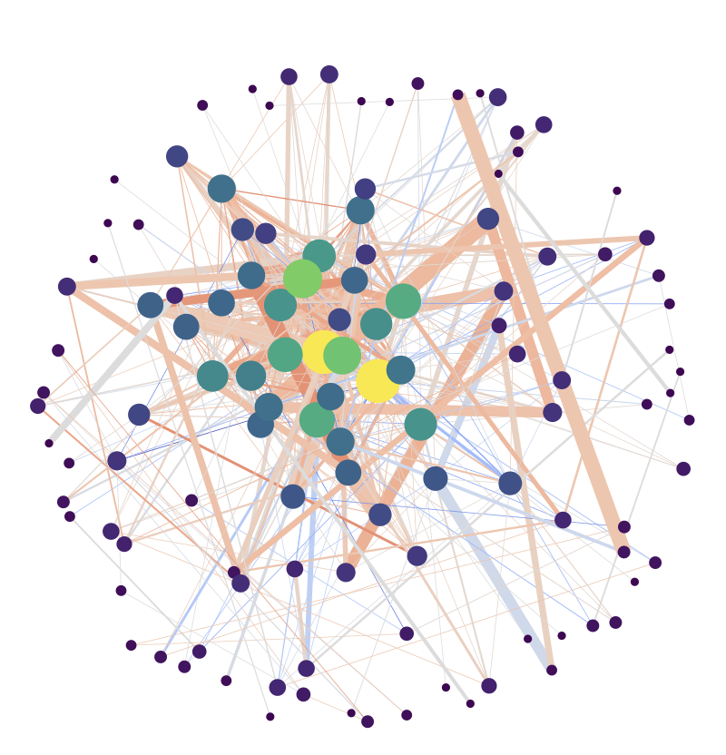

APPARENT 
======================

   
**Apparent** is a Python toolkit for analyzing patient referral flows within US healthcare systems using **medical claims data** (Medicare). We provide functionality for building and analyzing patient referral networks. In particular, we provide functionality to analyze these networks via **discrete curvature** and **persistent homology**, in hopes of supporting further research developments into using network analysis to improve efficiency and equity of the US healthcare system.

Prototype & Publication
-----------------------

- **Prototype Tool**: `apparent.topology.rocks <https://apparent.topology.rocks/>`_
- **Paper**: `Analyzing Physician-Patient Referral Networks Using Discrete Curvature and Persistent Homology <https://arxiv.org/abs/2408.16022>`_

Features
--------

- **Build Networks**: Generate directed and undirected graphs representing referral relationships between physicians and patients.
- **Describe Networks**: Compute node- and edge-level features like degree, clustering coefficients, betweenness centrality, curvature measures, and persistence diagrams.
- **Compare Networks**: Measure pairwise similarity or distances between networks using curvature metrics and topological features.
- **Embed Networks**: Map networks into a lower-dimensional vector space for visualization and machine learning tasks.
- **Cluster Networks**: Group networks into clusters based on structural or functional similarity, leveraging techniques like k-means, hierarchical clustering, and DBSCAN.

Installation
------------

APPARENT uses `uv <https://github.com/astral-sh/uv>`_ as the package manager, which provides faster dependency resolution and installation.

**Step 1: Clone the Repository**

.. code-block:: bash

    git clone https://github.com/aidos-lab/apparent.git
    cd apparent

**Step 2: Install Dependencies and Activate Virtual Environment**

If you don't already have ``uv``, install with pip:

.. code-block:: bash

    pip install uv

To install dependencies, run:

.. code-block:: bash

    uv sync

You'll notice this creates a ``.venv`` folder in the root directory.

We activate that new virtual environment as such:

.. code-block:: bash

    source .venv/bin/activate

**Step 3: Specify Environment Variables in .env**

.. code-block:: bash

    touch .env
    echo APPARENT_URL="https://apparent.topology.rocks/us_physician_referral_networks.csv" >> .env

This points the directory to the location where the database is stored.

Usage
-----

Most actions can completed using the ``Apparent`` object, including the following functionality:

1. *Pull Data:* Extract data from our datasette tool (or local instance).
2. *Build Networks:* Construct physician-patient referral graphs from the extracted data.
3. *Describe Networks:* Compute network features such as curvature, centrality, and clustering coefficients.
4. *Compare Networks:* Analyze pairwise distances between networks using metrics like Forman curvature and Ollivier-Ricci curvature.
5. *Embed Networks:* Reduce dimensionality for visualization and machine learning.
6. *Cluster Networks:* Group similar networks using clustering algorithms like ``KMeans``, ``DBSCAN``, and hierarchical clustering.

Quick Example
~~~~~~~~~~~~~

Here's a quick example for how you can pull specific Physician Referral Networks using ``apparent``!

.. code-block:: python

    from apparent import Apparent

    # Initialize Apparent
    A = Apparent()

    # Example SQL query for fetching data
    my_query = """
              SELECT
                hospital_atlas_data.hsa,
                hospital_atlas_data.year,
                hospital_atlas_data.latitude,
                hospital_atlas_data.longitude
              FROM
                hospital_atlas_data
              WHERE
                hospital_atlas_data.year = 2017
              LIMIT
                10;
            """

    # Pull data from the database
    A.pull(my_query)

    # Build referral networks
    A.build_networks()

    # Compare networks based on Forman curvature
    A.compare(measure="forman_curvature")

    # Embed networks into a lower-dimensional space
    A.embed()

    # Cluster networks based on structural similarity
    A.cluster_networks()

Contributing
------------

Contributions are welcome! To contribute:

1. Fork the repository.
2. Create a new branch (``git checkout -b feature-name``).
3. Commit changes (``git commit -m 'Add feature'``).
4. Push to your branch (``git push origin feature-name``).
5. Open a Pull Request.

Testing
-------

We use pytest for testing. To run the test suite, use:

.. code-block:: bash

    pytest tests/

Test coverage includes:

- Network construction and validation
- Feature computation for nodes and edges
- Pairwise comparison of networks
- Clustering and embedding functionalities

License
-------

This project is licensed under the BSD-3 License. See the LICENSE file for details.

Contact
-------

For questions, feedback, or collaboration opportunities please contact the AIODS Lab.

Table of Contents
------------------

.. toctree::
   :maxdepth: 2
   :caption: APPARENT

   apparent

.. toctree::
   :maxdepth: 2
   :caption:  -> Networks
   
   networks/build
   networks/cluster
   networks/compare
   networks/describe
   networks/embed

|

|
| **Interested in more of our work?**
|
| See what we are working on at `AIDOS Lab <https://aidos.group>`_ or check out our `GitHub <https://github.com/aidos-lab>`_.

